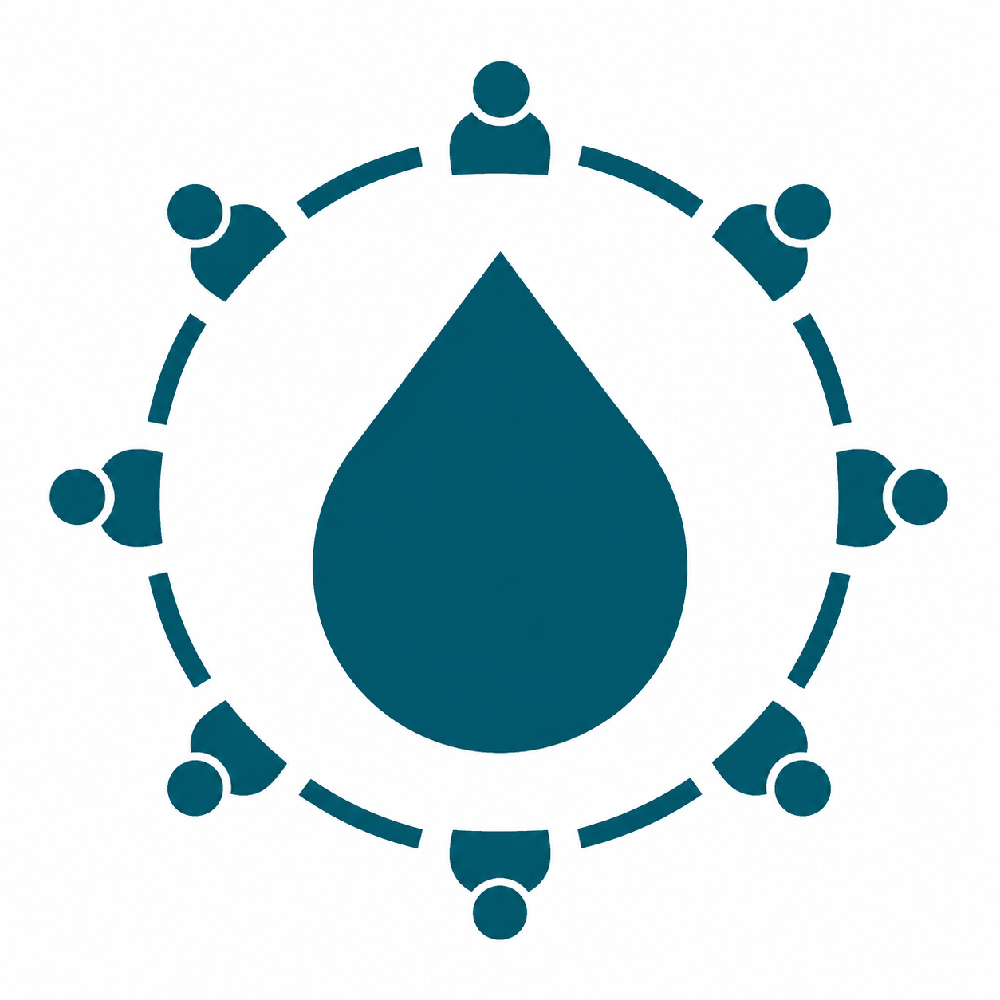
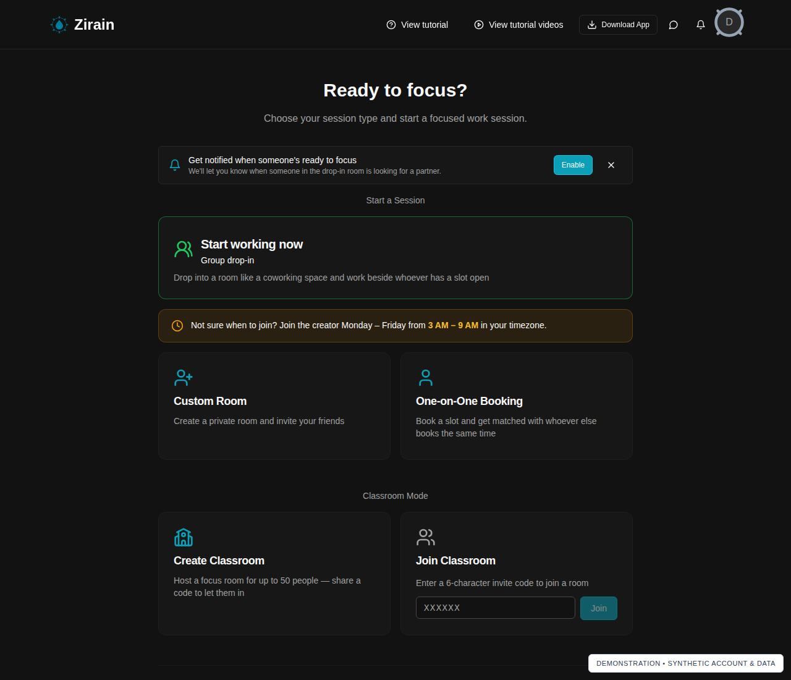
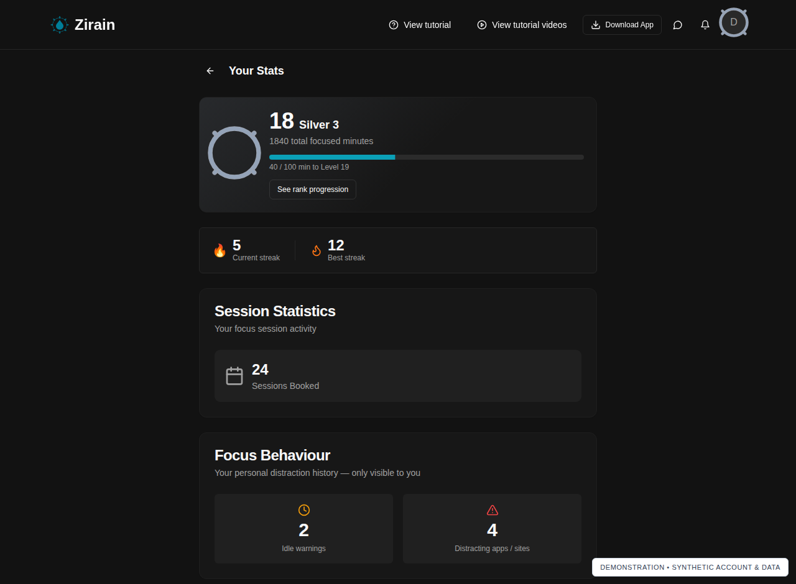
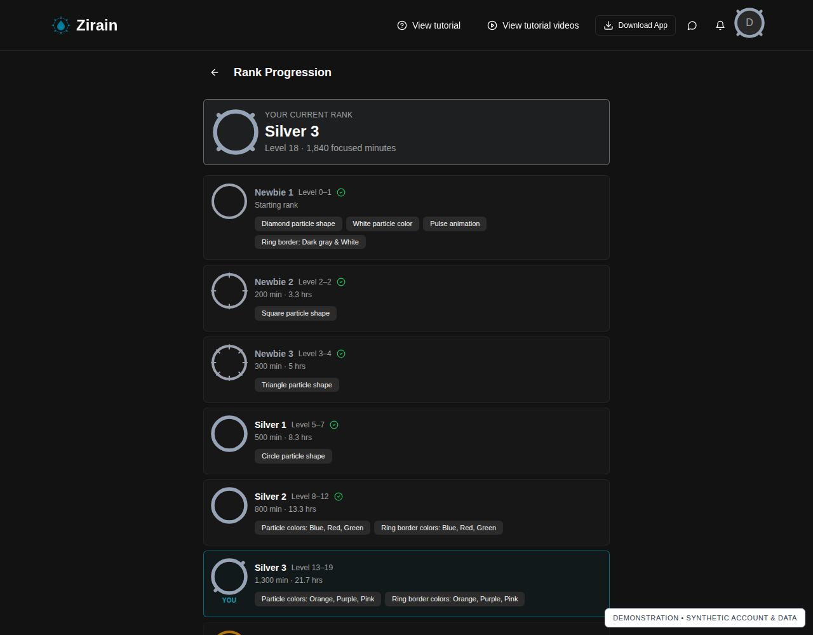

  

# Zirain

**A focus and accountability app for working alongside real people.**

Focus is easier when someone's there. Zirain brings people together in live focus sessions so you can work on your own goals with shared accountability.

**[Visit Zirain](https://zirain.com)** · **[Download the desktop app](https://zirain.com/download)**

## What Zirain does

- **Live focus sessions:** work alongside other people who are also trying to get something done.
- **Real-time accountability:** the desktop companion detects distractions and idle time during sessions, helping the room stay aware of your focus status.
- **Focus progress:** review your focused time and session statistics to see how your habits develop.
- **Ranks earned through focused hours:** your rank reflects the time you've put into focusing and appears on your profile and in sessions.

Zirain is for students, remote workers, founders, and anyone who finds it easier to follow through with other people present. This approach is often called *body doubling*: working alongside someone while each person tackles their own tasks.

## See Zirain in action

These screenshots show the current Zirain interface using a **synthetic demonstration account and sample data**. They do not show real users, live sessions, or private rooms. Example statistics are illustrative, not customer results.

### Choose how you focus

Start with a group drop-in, create a custom room, book a one-on-one session, or use classroom mode.

### Review your focus progress

See your focused minutes, rank, streaks, booked sessions, and personal focus behaviour.

### Earn ranks through focused time

Explore the rank progression and the visual rewards associated with focused hours.

## Get started

1. Visit **[zirain.com](https://zirain.com)** and create an account or sign in.
2. Open the **[download page](https://zirain.com/download)** to choose your platform and follow the current installation instructions.
3. Connect the desktop app to your account, join a focus session, and bring something you want to work on.
4. Review your progress as your focused hours add up.

The desktop app is currently offered for **Windows** and **macOS (Apple Silicon)**. Check the download page for current system requirements and availability.

## About this repository

This is Zirain's **public product showcase**, not its application source repository. It contains only this product overview, the Zirain logo, and reviewed product screenshots using synthetic demonstration data.

The Zirain website, backend, and desktop application are **proprietary software**. Their source code, build instructions, and release binaries are not published here. To use Zirain, visit the website and the official download page linked above.

No open-source license is granted by this repository. Public availability of these product materials does not grant a license to the application or permission to reuse Zirain's branding. Zirain's name and logo remain the property of their respective rights holder.
